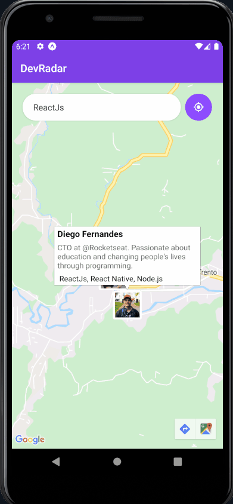

<h1 align="center">
    DevRadar
    <br>
</h1>
<h4 align="center">
  Cadastre-se para achar devs em um raio de 10km de você e fazer novos contatos.</br>
  Filtre suas buscar por tecnologias de interesse e conheça o GitHub dos devs próximos a você.</br>  
</h4>
<h4 align="center">
  
Sign up to find devs within 10km of you and make new contacts.</br>
Filter your search for technologies of interest and get to know the GitHub of the devs near you
</h4>
<p align="center">
  <a href="#rocket-technologies">Technologies</a>&nbsp;&nbsp;&nbsp;|&nbsp;&nbsp;&nbsp;
  <a href="#information_source-how-to-use">How To Use</a>&nbsp;&nbsp;&nbsp;|&nbsp;&nbsp;&nbsp;
  <a href="#memo-license">License</a>
</p>

<p align="center">
  
</p>

<p align="center">

  
  | ... |
  
  
</p>

## :rocket: Technologies

This project was developed with the following technologies:

- [ReactJS](https://pt-br.reactjs.org/)
- [React Native](https://reactnative.dev/)
- [Expo](https://expo.io/)
- [Node.js](https://nodejs.org/en/)
- [MoongoDB](https://www.mongodb.com/)

```bash
  #API's
```

- [Google Maps API](https://cloud.google.com/maps-platform?hl=en)
- [GitHub API](https://developer.github.com/v3/repos/)

## :information_source: How To Use

To clone and run this application, you'll need [Git](https://git-scm.com), [Node.js v10.16][nodejs] or higher + [Yarn v1.13][yarn] or higher installed on your computer. From your command line:

```bash
# Clone this repository
$ git clone https://github.com/igor-marchi/devRadar devRadar
# Go into the repository
$ cd devRadar
# Start backend
$ cd backend
# Install dependencies
$ npm install
# Start project
$ npm run dev
```

```bash
# For web
$ cd web
# Install dependencies
$ npm install
# Start project
$ yarn or npm start
```

```bash
# For mobile
$ cd mobile
# Install dependencies
$ npm install
# Start project (you need a mobile simulator)
$ yarn or npm start
```

## :memo: License

This project is under the MIT license. See the [LICENSE](https://github.com/igor-marchi/devRadar/blob/master/LICENSE) for more information.

Made with ❤ [Igor Marchi](https://www.linkedin.com/in/igor-marchi/) :laughing:
